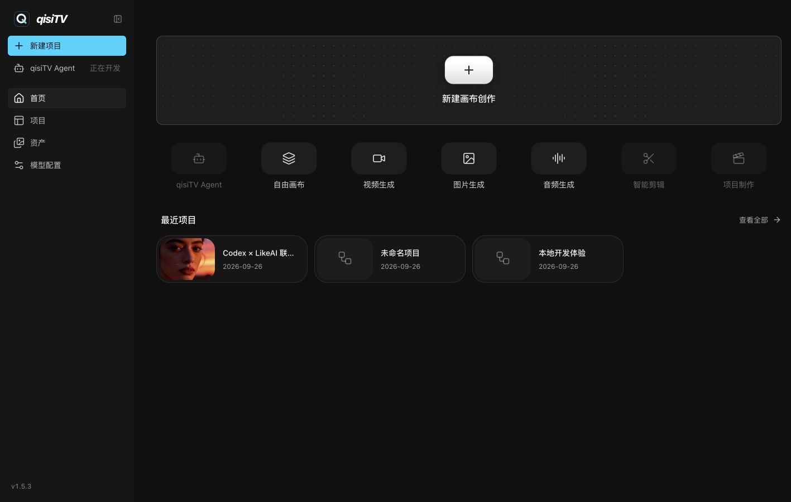

<p align="center">
  
</p>

<p align="center"><strong>本地优先 · 轻量 · AI Native</strong></p>

<p align="center">
  面向 AI 视频创作的自由画布。<br>
  在 Codex 等本地 Agent 中对话，在画布里组织素材、模型与生成结果。
</p>

<p align="center">
  <a href="#产品演示">产品演示</a> ·
  <a href="docs/content/docs/overview/features.mdx">功能清单</a> ·
  <a href="QUICKSTART.md">开始使用</a> ·
  <a href="CONTRIBUTING.md">参与贡献</a>
</p>

qisiTV 基于开源项目 [BeefTV](https://github.com/glanderness/BeefTV) 二次开发，项目、画布、素材和任务默认保存在本机。

## 产品演示



[观看上游产品演示视频](https://github.com/user-attachments/assets/94fe6a39-6933-44b3-a9a9-dbc28b2d284c)（展示上游界面，qisiTV 以本仓库截图为准）。

## 一个画布，完整创作链路

- **生成**：从提示词或参考素材生成文字、图片、视频与音频，支持 LikeAI 渠道。
- **组织**：用节点、连线、框选、缩放和小地图建立素材关系与创作流程。
- **加工**：继续裁切、标注、局部重绘、拆分、引用和组合结果。
- **迭代**：保留过程、复用素材，让一次生成变成可继续编辑的工作流。
- **本地 Agent**：通过 MCP 或 `qisitv` CLI 在 Codex 等工具中操作画布、导入素材和回填结果。

qisiTV 同时提供项目库、个人资产库、异步任务、模型渠道和创作工具。完整范围见[功能清单](docs/content/docs/overview/features.mdx)。生成失败时展示原因与调整建议，对提交状态不确定的任务限制直接重试，避免重复提交。

## 工作方式

```text
想法 / 参考素材 → 本地 Agent 对话 / 手动操作
                         ↓
                    qisiTV 自由画布
                         ↓
              模型 API + 创作工具 + 本地素材
                         ↓
              可编辑、可复用的图片 / 视频 / 分镜
```

## 开放与本地优先

- 当前版本统一使用 LikeAI，支持其目录中的文本、图片、视频与音频模型。
- 项目、画布、素材与任务由统一工作区管理，数据可以本地保存和迁移。
- 基于 React、Go 与 Wails，模型协议和工作台能力可继续扩展。
- 本地 Agent 连接使用现有工作区，不另建数据库。见 [MCP 与 CLI 接入](docs/content/docs/backend/local-agent.mdx)及 [LikeAI 配置](docs/content/docs/backend/likeai.mdx)。

## 开始使用

网站版无需注册。使用桌面 Chrome / Edge，在「本地文件与 Agent」选择一个项目根目录；每个项目的画布与素材自动写入独立文件夹。需要 Codex 时下载本地连接器，安装 `qisitv-web` MCP 并输入配对码，保持网页打开即可控制同一画布。使用、安装和数据边界见[网站版说明](docs/content/docs/backend/browser-workspace.mdx)。下面的旧桌面 Go 工作区独立保留，不与网站项目自动合并。

本地开发需要 Bun 和 Go 1.25。在本仓库中打开两个终端：

先获取 qisiTV 源码：

```bash
git clone https://github.com/wyuzhi/qisiTV.git
cd qisiTV
```

```bash
# 终端一：后端
cd backend
CANVAS_BACKEND_ADDR=127.0.0.1:8080 \
CANVAS_BACKEND_DATA_DIR=../.local/project-workbench-debug \
go run ./cmd/server

# 终端二：前端
cd web
bun install --frozen-lockfile
bun run dev
```

打开 <http://localhost:3000>。前端默认将 `/api` 代理到 `http://127.0.0.1:8080`。首次使用时在设置中填写自己的 LikeAI API Key 并拉取模型；模型 API 的生成费用由供应商收取。

详细环境要求、Windows 构建与桌面发布方式见 [`QUICKSTART.md`](QUICKSTART.md) 和[桌面发布文档](docs/desktop-release.md)。

## 项目状态与安全

qisiTV 正在快速迭代，数据结构和外部接口仍可能变化。建议在个人设备或可信环境中使用，并避免将本地 workspace API 直接暴露到公网。不要提交 API Key、Cookie、数据库或本机配置。

- [更新记录](CHANGELOG.md)
- [安全策略](SECURITY.md)
- [贡献指南](CONTRIBUTING.md)

## 贡献与许可

欢迎提交 Issue 和 Pull Request。开发流程与测试要求见 [`CONTRIBUTING.md`](CONTRIBUTING.md)。

项目按照 [`LICENSE`](LICENSE) 发布；上游来源、保留声明与第三方归属见 [`NOTICE`](NOTICE)。
